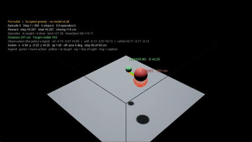
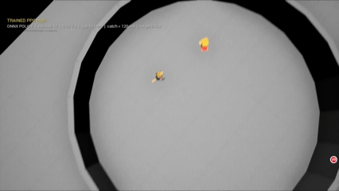
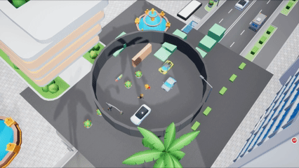
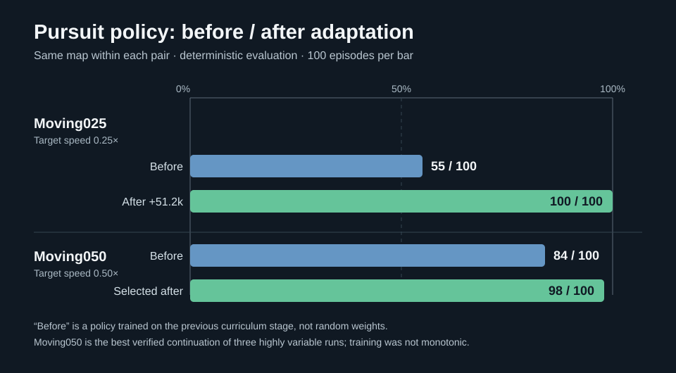

# PursuitAI

[English](README.en.md) · [日本語](README.ja.md)

在 Unreal Engine 5.7 里训练角色追逐策略的实验项目。追击者是 `ACharacter`，目标按规则逃跑；环境由 C++ 提供观测、动作、奖励和回合结束条件，AMD Schola 连接 Stable-Baselines3 的 PPO。训练后将策略导出为 ONNX，由 UE 内的 NNE 执行推理。

这里的“通用”指**训练与评估闭环可以复用**：静止目标、不同速度的移动目标、不同关卡都走同一套环境接口和工具。它**不是**“输入任意地图和规则，就自动产出可用模型”的平台。换任务仍需检查可达性、观测是否充分、动作与奖励定义，并重新训练、独立评估。

## 已验证的范围

```text
UE C++ 环境（15 维观测 / 3 维动作）
    → Schola / gRPC → SB3 PPO → checkpoint
    → ONNX 适配与动作对拍 → UE NNE 推理
```

目前只训练追击者；逃跑者是规则控制。默认模型用于**无内部障碍的平地移动目标追逐**，圆形场地的外周墙带碰撞。城市布景、内部障碍、跳跃执行器与多名追击者是后续阶段逐步加入的（见下节 v2 / v3）。

## 四个阶段：v0 → v3

| 阶段 | 目标 | 说明 |
|---|---|---|
| **v0 · 球体追逐原型** | 打通训练闭环 | 用简单球体代替角色，只验证「UE 出观测 → Schola/gRPC → PPO 出动作 → 抓捕率随训练上升」这条链路。没有角色动画、追击相机和内部障碍。 |
| **v1 · 角色追逐** | 换成角色 + 课程化训练 | 追击者改为 `ACharacter`（骨骼网格 + 角色移动组件）：观测 15 维（目标方向、距离、自身与目标速度，外加五路前向射线）、动作 3 维连续量。课程为静止目标 → Moving025 → Moving050，成绩见下一节。 |
| **v2 · 障碍与城市布景** | 场景扩展与迁移检验 | 场地加入内部障碍、墙体与城市布景，观测扩展出墙体距离与净空通道，用于检验「已学会的追逐策略在有障碍的场景里如何表现」。 |
| **v3 · 跳跃维度与多人追捕** | 执行与协同层面的扩展 | 环境加入跳跃执行器（由关卡的 `bEnableAgentJump` 控制是否启用）与第二名追击者 `SupportAgent`：角色可以翻越低墙，两名追击者可以协同围捕逃跑者。 |

<table>
  <tr>
    <td align="center"><b>v0 · 球体追逐原型</b><br></td>
    <td align="center"><b>v1 · 角色追逐</b><br></td>
  </tr>
  <tr>
    <td align="center"><b>v2 · 障碍与城市布景</b><br></td>
    <td align="center"><b>v3 · 跳跃维度与多人追捕</b><br></td>
  </tr>
</table>

## 训练前后：同关卡独立评估



| 关卡 | 本关卡续训前 | 续训后 | 协议 |
|---|---:|---:|---|
| Moving025，目标速度 0.25× | 55/100 | 100/100 | 静止任务模型零样本 → 在 Moving025 续训 51,200 实际采样步 |
| Moving050，目标速度 0.50× | 84/100 | 98/100 | Moving025 模型零样本 → 选出的 Moving050 续训模型 |

每个数字来自独立的 101 回合确定性评估；第 1 回合作为 warm-up，正式统计第 2–101 回合。它们**不是配对的同一批出生点**。“训练前”也不是随机权重，而是上一课程阶段训练过的模型。Moving050 的训练并非单调进步：多个续训分支差异很大，98/100 是经过正式复评的选定分支，不代表随便再训都能达到这个值。

数据见 [汇总 CSV](docs/results/summary.csv)、[逐回合 CSV](docs/results/formal_episodes.csv) 和四份 [评估解析结果](docs/results/)；图直接按 CSV 的 100 回合抓捕数绘制。行为均值仅覆盖有完整 UE 回合日志的 99 回合，不与 Python 侧的 100 回合抓捕率混用。训练 checkpoint 未上传；[溯源说明](docs/results/PROVENANCE.md)记录了模型身份和统计窗口。

## 运行条件与目录

- Windows、Unreal Engine 5.7、Python 3.12。
- [AMD Schola](https://github.com/GPUOpen-LibrariesAndSDKs/Schola) 插件使用 `v2.1.1`；放在 `Plugins/Schola/`。插件源码不随本仓库复制，可执行 `git clone --branch v2.1.1 --depth 1 https://github.com/GPUOpen-LibrariesAndSDKs/Schola.git Plugins/Schola` 取得。
- 角色外观依赖 Fab 的 `RPGHeroSquad`，城市资源依赖 `Cartoon_City_Free`；两者的原始资产**不在仓库中**。没有资产时不要据此判断训练或 ONNX 失效。
- `Source/PursuitAI/` 是训练环境与角色动作；`Content/Maps/L_PursuitCharCurriculum`、`Moving025`、`Moving050` 是课程关卡；`L_PursuitCharDemoCircle` 是单独的展示关卡。`tools/` 放关卡生成、训练、解析和演示脚本。

在项目根目录创建 Python 虚拟环境，并安装 Schola 的 SB3 可选依赖：

```powershell
py -3.12 -m venv .venv
& .\.venv\Scripts\python.exe -m pip install -e ".\Plugins\Schola\Resources\python[sb3]"
```

生成或检查课程关卡可用 `tools/run_pyscript.ps1` 和 `tools/gen_char_curriculum_level.py`。首次从零训练的 Schola 命令示例：

```powershell
& .\.venv\Scripts\schola.exe sb3 train ppo project PursuitAI.uproject `
  --map /Game/Maps/L_PursuitCharCurriculum --headless `
  --build-dir Build/Staging --timesteps 60000 `
  --save-final-policy --checkpoint-dir checkpoints/static `
  --enable-tensorboard --log-dir logs/tb/static --disable-eval --no-pbar
```

后续迁移到 Moving025/Moving050 要显式指定原 checkpoint，避免误从随机权重开始；`tools/run_training_char_curriculum.sh` 提供带关卡白名单和输出隔离的续训入口。以上命令是本项目的工作流示例，不保证不同机器上的构建时间和结果一致。

## 看演示

仓库只附一个经过动作对拍的 [rep3 ONNX](models/rep3_sb3_exact.onnx)，不上传大量 checkpoint、Fab 资源、构建缓存或原始录像。设置 `UE_ENGINE_ROOT` 为本机 UE 5.7 安装目录后：

```powershell
& .\tools\run_demo_circle.ps1 -View Arena   # 看完整圆环
& .\tools\run_demo_circle.ps1 -View Follow  # 看更大的角色
```

演示关卡使用 450–600 cm 出生距离、0.50× 移动目标、6 秒回合上限。固定种子 `20260923` 的独立 20 回合筛查为 19 抓、1 超时；这是演示配置结果，**不替代**上表的 Moving050 正式评估。左上角显示实时距离和判定参数。ONNX 与 SB3 确定性动作在 400 条真实观测上最大误差 `1.192e-7`，见 [对拍记录](docs/results/onnx_parity.txt)。旧的 `tools/export_policy.bat` 对本 checkpoint 使用了不匹配的 Tanh 后处理，不应拿它重导此模型；其他模型也必须分别对拍。
